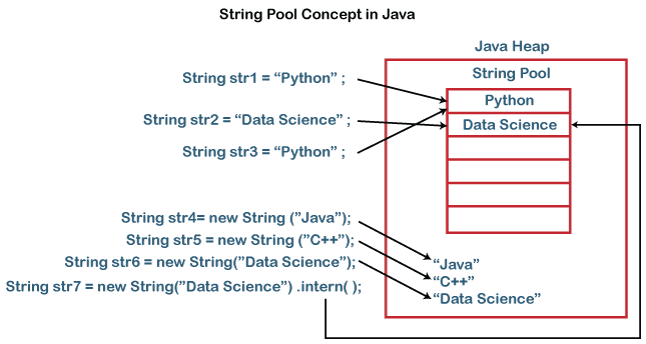
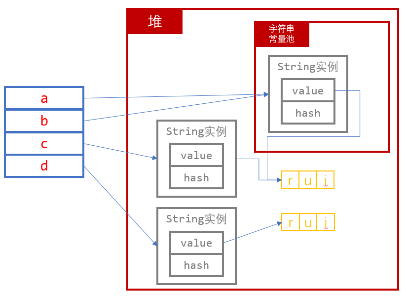

## 基本数据类型
Java中的基本数据类型信息如下表所示：

| 基本类型 | 位数 | 字节 | 默认值 | 取值范围                               |
| -------- | ---- | ---- | ------- | ------------------------------------------ |
| byte     | 8    | 1    | 0       | -128 ~ 127                                 |
| short    | 16   | 2    | 0       | -32768 ~ 32767                             |
| int      | 32   | 4    | 0       | -2147483648 ~ 2147483647                   |
| long     | 64   | 8    | 0L      | -9223372036854775808 ~ 9223372036854775807 |
| char     | 16   | 2    | 'u0000' | 0 ~ 65535                                  |
| float    | 32   | 4    | 0f      | 1.4E-45 ~ 3.4028235E38                     |
| double   | 64   | 8    | 0d      | 4.9E-324 ~ 1.7976931348623157E308          |
| boolean  | 1    |      | false   | true、false                               |

### 基本数据类型和对应包装类型的差别
Java中每个基本数据类型都有对应的包装类型，而Java自带了**自动装箱**和**自动拆箱**机制方便基本类型和包装类型之间的相互转换。基本数据类型和对应包装类型主要有以下差别：
1. 基本数据类型实例的身份和值是一个东西；包装类型实例的身份是他的内存地址，与值关系不大；
2. 基本数据类型始终是**有值**的；包装类型可以是`null`；
3. 基本数据类型不能用作泛型；包装类型可以；
4. 基本数据类型时、空效率更好。

下面代码中，使用包装类型时，在执行第6行时需要频繁地进行自动拆装箱，需要花费较多时间。
:::: code-group
::: code-group-item 使用基本数据类型（0.5s左右）
```Java
public class Boxing {
    public static void main(String[] args) {
        long start = System.currentTimeMillis();
        long sum = 0L;
        for(int i=0; i < Integer.MAX_VALUE; i++) {
            sum+=i;
        }
        System.out.println(System.currentTimeMillis() - start);
    }
}
```
:::
::: code-group-item 使用包装类型，需要自动拆装（6s左右）
```Java
public class Boxing {
    public static void main(String[] args) {
        long start = System.currentTimeMillis();
        Long sum = 0L;
        for(int i=0; i < Integer.MAX_VALUE; i++) {
            sum+=i;
        }
        System.out.println(System.currentTimeMillis() - start);
    }
}
```
:::
::::

### 选择依据
存在以下情况时，选用包装类型，否则使用基础数据类型。
1. `null`值是可接受的或者可能出现的；
2. 泛型类型必须是包装类型。

### 包装类型的缓存机制
一些基础类型的包装类型有其缓存机制，即直接取缓存（数组）中的值，而非去堆中重新开辟空间并分配值，以`Integer`类为例看源码中的实现：
:::: code-group
::: code-group-item Integer中的缓存实现方式
```Java
private static class IntegerCache {
    static final int low = -128;
    static final int high;
    static final Integer cache[];

    static {
        // high value may be configured by property
        int h = 127;
        String integerCacheHighPropValue =
            sun.misc.VM.getSavedProperty("java.lang.Integer.IntegerCache.high");
        if (integerCacheHighPropValue != null) {
            try {
                int i = parseInt(integerCacheHighPropValue);
                i = Math.max(i, 127);
                // Maximum array size is Integer.MAX_VALUE
                h = Math.min(i, Integer.MAX_VALUE - (-low) -1);
            } catch( NumberFormatException nfe) {
                // If the property cannot be parsed into an int, ignore it.
            }
        }
        high = h;

        cache = new Integer[(high - low) + 1];
        int j = low;
        for(int k = 0; k < cache.length; k++)
            cache[k] = new Integer(j++);

        // range [-128, 127] must be interned (JLS7 5.1.7)
        assert IntegerCache.high >= 127;
    }

    private IntegerCache() {}
}

public static Integer valueOf(int i) {
    if (i >= IntegerCache.low && i <= IntegerCache.high)
        return IntegerCache.cache[i + (-IntegerCache.low)];
    return new Integer(i);
}
```
:::
::::
即将`[-128, 127]`区间中的所有数字缓存了起来。除此以外，Byte、Short、Long缓存也为`[-128, 127]`，Character缓存区间为`[0, 127]`。

## String类型
在Java中String是一个**类**，继承了`Serializable`、`Comparable`、`CharSequence`三个接口。
### 创建String实例的两种方式
1. 使用`String`字面量

```flow:preset
st=>start: 开始
e=>end: 结束
op1=>operation: 返回常量池中String常量的引用
op2=>operation: 在堆中开辟一个char数组，存储字面量
op3=>operation: 使用上一步中的char数组，在常量池中创建一个String常量，并返回
sub1=>subroutine: 子程序
cond=>condition: 常量池已存在?

st->cond
cond(yes)->op1->e
cond(no, right)->op2->op3->e
```

2. 使用`new`关键字新建
```flow:preset
st=>start: 开始
e=>end: 结束
op1=>operation: 在堆中开辟一块内存，根据对象初始化流程初始化字符串实例
op2=>operation: 返回该引用

st->op1->op2->e
```

### 字符串常量池

关于字符串常量池，下面的示意图[^first]绘制的比较清晰的，很明显字符串常量存储在字符串常量池中。但是要注意的是，这里的**字符串常量**指的是什么？是`Java`这个串？还是一个`String`类实例？理应是**后者**。
[^first]: [https://www.javatpoint.com/string-pool-in-java](https://www.javatpoint.com/string-pool-in-java)



这样理解的话，上图其实不够准确，`String`是一个类，每个`String`类实例都包含了2个成员变量`private final char[] value`和`private int hash`，因此一个`String`对象内存布局中实例数据只有**4字节的value数组指针**和**4字节的hash值**（可能还有对齐填充）。也就是说常量池中存的是`String`对象实例，而这个实例中的`value`将指向堆中的一块区域（`char[]`数组）。如下示例：
:::: code-group
::: code-group-item String初始化示例
```Java
String a = "rui";
String b = "rui";
String c = new String("rui");
char[] chars = new char[]{'r', 'u', 'i'};
String d = new String(chars);
```
:::
::::


### 不可变的String
关于String是不可变的，只需记住**String对象**是不可修改的（即无法对该对象中的任何实例数据进行操作），而我们通常进行的String操作修改的都是**引用的指向**。

同时String是**被设计成**不可变的，而非因为其声明了final等关键字**导致其成为了**不可变的。String被设计成不可变的有以下几点原因[^second]：
[^second]: [https://www.javatpoint.com/why-string-is-immutable-or-final-in-java](https://www.javatpoint.com/why-string-is-immutable-or-final-in-java)

- 节省堆空间。如果不可变，无法使用常量池，堆中将可能存在大量相同的字符串从而浪费空间。
- 可变字符串会对应用程序构成严重的安全威胁。例如，数据库用户名、密码作为字符串传递以接收数据库连接；套接字编程主机和端口描述也作为字符串传递。由于String不可变，所以它们的值不能改变。如果字符串可变的，黑客可以随意更改引用值，从而在应用程序中引起安全问题。
- 多线程安全。
- 保证了类加载过程的安全性。例如，假设我们尝试加载`java.sql.Connection`类，但被修改成了`myhacked.Connection`类。

::: warning 破坏String的不可变性
笔者尝试过在JDK8下使用反射更改字符串常量的`value`属性，能够成功更改，但是会出现一系列“奇怪”的现象，感兴趣的朋友可以自己试试。由于这些“奇怪”的现象是难以预料和分析的，因此业务代码中不应该出现破坏String不可变性的代码[^third]。

另外，JDK11中的反射机制移除了对`private`成员常量的修改权限，若修改会抛异常。

[^third]: [https://stackoverflow.com/questions/1552301/immutability-of-strings-in-java](https://stackoverflow.com/questions/1552301/immutability-of-strings-in-java)
:::


## 泛型编程
使用泛型编程主要是两个目的：**代码重用**和**类型安全**。
### 代码重用
很好理解，当我编写一个类或者方法时，需要对多种类型数据进行相同的操作，实际上没必要为每种输入参数类型重载一个方法。

要注意，使用泛型定义的两个类型会因为泛型类型的不同而不同，如下代码11行所示：
:::: code-group
::: code-group-item 泛型示例
```Java
public class Generic<T> {
    private T obj;
    public Generic(T obj) {this.obj = obj;}

    public static void main(String[] args) {
        Generic<Integer> integerGeneric = new Generic<>(1);
        Generic<String> stringGeneric = new Generic<>("1");
        System.out.println(integerGeneric instanceof Generic); // true
        System.out.println(stringGeneric instanceof Generic); // true
        System.out.println(stringGeneric.getClass() == integerGeneric.getClass()); // true
        integerGeneric = stringGeneric; // 赋值操作会导致编译错误
    }
}
```
:::
::::

### 类型安全
使用泛型可以帮助我们在**编译时期**而非**运行时期**发现类型不一致的问题。例如我们定义了一个**ArrayList**，希望用其存储一些数字，但未指定泛型类型。此时编译器允许我们往容器中可以添加任意类型的数据而不会报错，那么当我们错误地添加了其他类型数据例如字符串等时，就会造成运行时错误。而使用泛型便能**将该错误提前到编译时期**。

另外，如第9行所示，使用泛型后，我们无需再手动指定类型转换方式。
:::: code-group
::: code-group-item 不使用泛型
```Java
public class Generic {
    public static void main(String[] args) {
        ArrayList list = new ArrayList();
        list.add(1);
        list.add(2);
        list.add("3"); // 编译器不会报错
        int sum = 0;
        for (Object i : list) {
            sum += (Integer) i; // 在第三次循环会抛异常
        }
        System.out.println(sum);
    }
}
```
:::
::: code-group-item 使用泛型
```Java
public class Generic {
    public static void main(String[] args) {
        ArrayList<Integer> list = new ArrayList<>();
        list.add(1);
        list.add(2);
        list.add("3"); // 编译器直接报错
        int sum = 0;
        for (Integer i : list) {
            sum += i;
        }
        System.out.println(sum);
    }
}
```
:::
::::